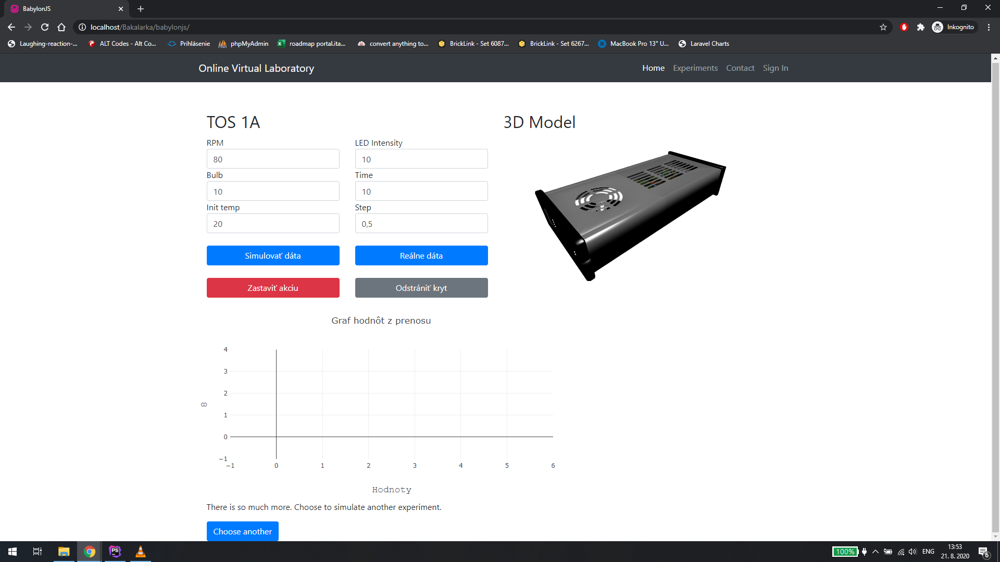

# TOS-1A
The final version of a project for my Bachelor thesis, where user can adjust inputs for simulation of a TOS-1A and output of this simulation will be shown in a form of graphs and also visualised using a 3D model rendered using a BabylonJS library.
## Installation
Clone this repository.

## Usage
Use only Real data, using the Simulate data button is not working, since the application needs to be connected to a Matlab simulation server.
## Screenshot

